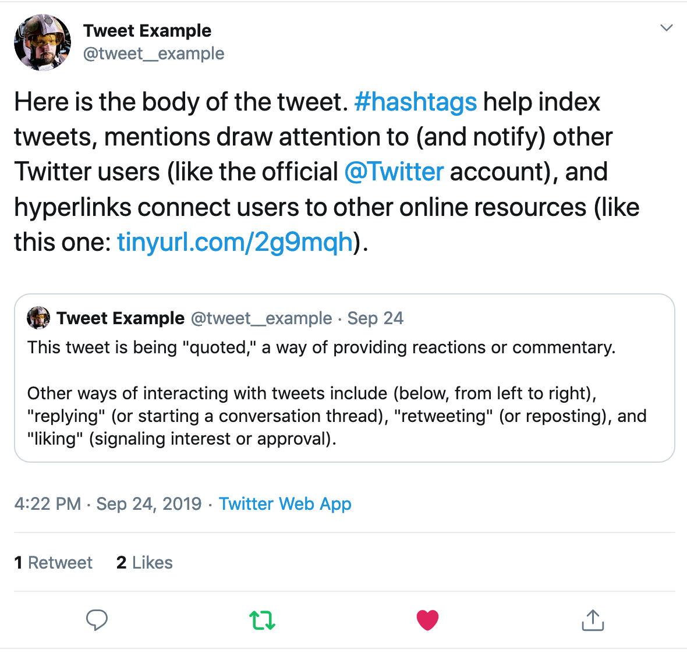
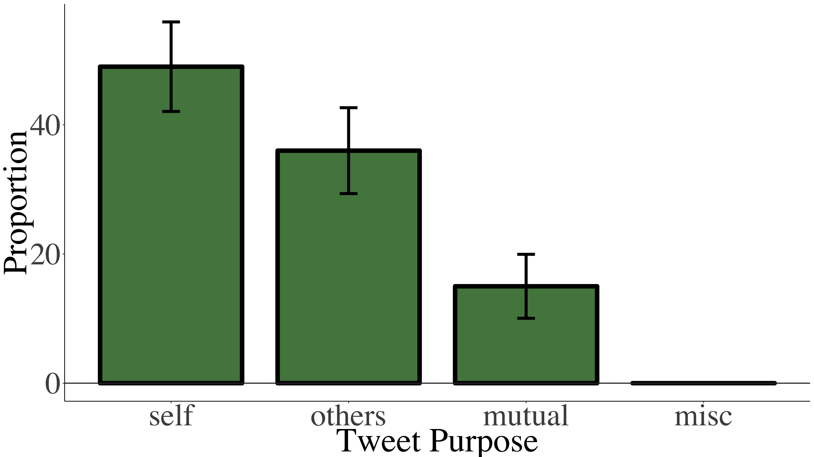
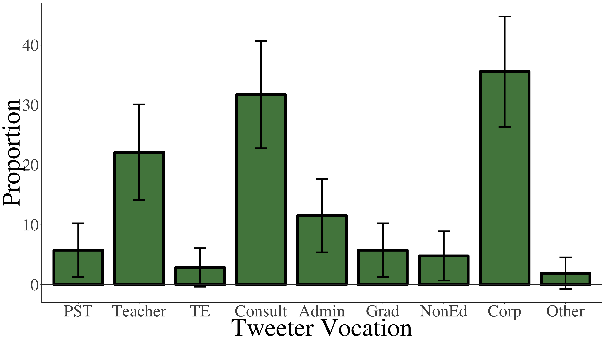
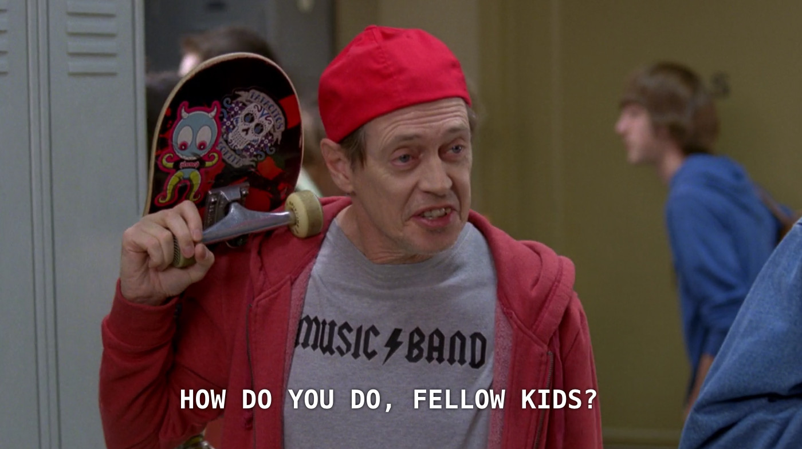

```{r setup, include=FALSE}
usethis::use_git_ignore(c("*.csv", "*.rds"))
options(htmltools.dir.version = FALSE)

# see options for customize slides: 
# https://slides.yihui.name/xaringan/
# https://slides.yihui.name/xaringan/incremental.html
# https://github.com/yihui/xaringan/wiki

library(knitr)
library(tidyverse)
library(xaringan)
```

class: inverse, center, middle

**Access our slide deck here:**  
https://bretsw.github.io/ntchat/

**Follow us on Twitter:**  
[@bretsw](https://twitter.com/bretsw) and [@LaurenBagdy](https://twitter.com/LaurenBagdy)

---

class: inverse, center, middle

# Twitter in Education

---

# Twitter Effects: Group Behavior

```{r, out.width = "720px", echo = FALSE, fig.align = "center"}
include_graphics("img/group-behavior.jpg")
```

---

# Twitter Effects: Alone Together

```{r, out.width = "720px", echo = FALSE, fig.align = "center"}

```

---

# Twitter Effects: Identity and Anonymity

```{r, out.width = "720px", echo = FALSE, fig.align = "center"}

```

---

# Twitter Effects: Mediated Reality

```{r, out.width = "720px", echo = FALSE, fig.align = "center"}
include_graphics("img/mediated-reality.jpg")
```

---

# Twitter Content

```{r, out.width = "600px", echo = FALSE, fig.align = "center"}

```

---

# Twitter Hashtags

```{r, out.width = "300px", echo = FALSE, fig.align = "center"}
include_graphics("img/hashtag.jpg")
```

### Many different uses!

* topical index: #Teaching

--

* humor and wit: #CoolTeacher

--

* synchronous chats: #SatChat

--

* "space" for ongoing discussions: #Edchat, #ITeachMath

---

class: inverse, center, middle

# #ntchat

**"new teacher chat"**

Wednesdays 8:00-9:00pm EST  
on Twitter

---

class: inverse, center, middle

# Purpose

---

# Purpose

The purpose of this study was to:

--

* examine Twitter #ntchat

--
 
* understand more about participants
 
--

* understand how participants are using #ntchat

--

* work-in-progress!

```{r, out.width = "450px", echo = FALSE, fig.align = "center"}
include_graphics("img/construction.jpg")
```

---

# Research Questions

```{r, out.width = "480", echo = FALSE, fig.align = "center"}
include_graphics("img/question.jpg")
```

--

1. What are participants doing in #ntchat? 

--

1. Who is contributing to #ntchat? 

---

class: inverse, center, middle

# Method

---

# Data Collection

* We collected tweets with a `Twitter Archiving Google Sheet (TAGS)` (Hawksey, 2014)

--
  * all tweets containing the keyword text "#ntchat"

--

  * May 1, 2018 to October 1, 2019 (17 months)

--

* We obtained tweet metadata using the `rtweet` R package (Kearney, 2018)

---

# Data Analysis

### Quantitative Analysis

--

* We calculated statistical analyses using R

---

# Data Analysis

### Qualitative Analysis of Tweets

--

* We randomly sampled 200 tweets from #ntchat posts and replies
  
--

* We used an a priori coding scheme (see Staudt Willet, 2019) 
  
--

* Categories of tweet purposes related to:
  1. *self* - promoting one’s own work
  1. *others* - highlighting the work of peers
  1. *mutual engagement* - discussing ideas or collaborating
  1. *miscellaneous* - anything not captured by the first three categories—such as news, didactic content, and tweets that were off topic

--

* We checked inter-rater reliability (IRR):

--

  * *percent agreement* was 84.50%
  * *Cohen’s kappa* was .75, suggesting substantial agreement (Landis & Koch, 1977)

---

# Data Analysis

### Qualitative Analysis of Tweeters

--

* We used the same random sample of 200 #ntchat tweets, resulting in 104 tweeters

--

* Categories of tweeters:
  1. *pre-service and newly in-service teachers*
  1. *teacher educators*
  1. *educational technology companies and organizations*
  1. *teacher*
  1. *administrator*
  1. *other/unknown*

--

* We checked inter-rater reliability (IRR):

--

  * because categories were not mutually exclusive, IRR scores were calculated for each category
  * *percent agreement* ranged from 91.35% to 98.08%
  * *Cohen’s kappa* ranged from .71 to .96, suggesting substantial to almost perfect agreement (Landis & Koch, 1977)

---

class: inverse, center, middle

# Results

---

# Results

### RQ1. What are participants doing in #ntchat? 

--

* 17 months of #ntchat tweets

--

* 16,012 different tweeters created 48,421 unique tweets 

--

* We wanted to focus on **contributions** to #ntchat

--

  * original posts
  * replies
  * *NOT* retweets
  
--

* 1,511 (9.44% of all tweeters) different tweeters created 16,693 (34.47% of all tweets) unique tweets

---

# Results

### RQ1. What are participants doing in #ntchat? 

--

* mean contribution of **tweets per tweeter** was 11.05 (*SD* = 67.54)
  * median was 1 
  * range was 1 to 1,924

--

* 47.65% of contributors tweeted to #ntchat only once in nine months 

--

* 92.58% of contributors tweeted to #ntchat less than an average of once per month

--

* 50.94% of #ntchat tweets were **retweeted**
  * mean *retweets* per tweet was 2.12 (*SD* = 12.80)
  * median was 1
  * range was 0 to 699

--

* 71.01% of #ntchat tweets were **liked**
  * mean *likes* per tweet was 4.76 (*SD* = 27.02)
  * median was 1
  * range was 0 to 1,639

---

# Results

### RQ1. What are participants doing in #ntchat?

--

* 49.00% of tweet purposes related to **self**

--

* 36.00% of tweet purposes related to **others**

--

* 15.00% of tweet purposes related to **mutual engagement**

--

* no tweets were categorized as **miscellaneous**

--

**Visualization of these results (with 95% confidence-interval margins of error) -->**

---

# Results

### RQ1. What are participants doing in #ntchat?

```{r, out.width = "720px", echo = FALSE, fig.align = "center"}

```

---

# Results

### RQ2. Who is contributing to #ntchat? 

--

* 35.58% of #ntchat tweeters were **educational technology companies and organizations** 

--

* 31.73% of #ntchat tweeters were **educational consultants, speakers, authors, and trainers**

--

* 22.12% of #ntchat tweeters identified themselves with the broad category of **teacher**

--

* 11.54% of #ntchat tweeters were **administrators**

--

* 5.77% of #ntchat tweeters were **pre-service and newly in-service teachers**

--

* 2.88% of #ntchat tweeters were **teacher educators** 

--

* 1.92% of #ntchat tweeters were **other/unknown**

--

**Visualization of these results (with 95% confidence-interval margins of error) -->**

---

# Results

### RQ2. Who is contributing to #ntchat? 

```{r, out.width = "720px", echo = FALSE, fig.align = "center"}

```

---

class: inverse, center, middle

# Significance

---

# Participation Inequality

```{r, out.width = "720px", echo = FALSE, fig.align = "center"}

```

--

**What does this mean for creating a "community" online?**

---

# Unintended Audiences

```{r, out.width = "720px", echo = FALSE, fig.align = "center"}

```

--

**What does this mean for new teachers seeking professional learning supports?**

---

# Future Research

```{r, out.width = "600", echo = FALSE, fig.align = "center"}
include_graphics("img/future-research.jpg")
```

--

* self-reports

--

* comparison: #ntchat, #NT2t

--

* longitudinal: #ntchat over the years

---

class: inverse, center, middle

# Where do new teachers seek support? 

*(Audience Discussion)*

---

class: inverse, center, middle

# Questions?

Bret Staudt Willet: [staudtwi@msu.edu](mailto:staudtwi@msu.edu)  
Lauren Bagdy: [lbagdy@fsu.edu](mailto:lbagdy@fsu.edu)


The Github repository for this presentation is  
https://github.com/bretsw/ntchat